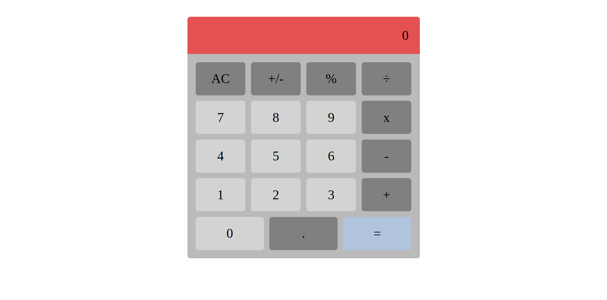

# Calculator

> This is a functional calculator made with crate-react-app.



## Built With

- HTML
- CSS
- Javascript
- React

## Live Demo

[Live Demo Link](https://react-calculator-ln.herokuapp.com/)


## Getting Started

To get a local copy up and running follow these simple example steps.

### Prerequisites

- node

### Setup

- - First, we need to clone the project, open your terminal and cd to the directory where you want the project to be in.
- Once inside the location, use the following command to get a copy of this repository.
```
git clone git@github.com:JohannRodriguez/react-calculator.git
```
- You can now cd into the newly created directory to start working.

### Install

 In your terminal, inside the project location, run the following command to install node packages:
```
npm install
```
- Followed by:
```
npm run build
```

### Usage

- Once we install everything we can start using the game, in your terminal run:
```
npm run start
```
- Wait for the project to compile, it should open automatically in your web browser, if not, enter to this page
```
http://localhost:3000/
```


## Authors

👤 **Johann Rodriguez**

- Github: [@JohannRodriguez](https://github.com/JohannRodriguez)
- Twitter: [@BSapce](https://https://twitter.com/BSapce)
- Linkedin: [Johann Rodríguez](https://www.linkedin.com/in/johann-alonso-rodriguez-vazquez/)


## 🤝 Contributing

Contributions, issues, and feature requests are welcome!

Feel free to check the [issues page](https://github.com/JohannRodriguez/react-calculator/issues).

## Show your support

Give a ⭐️ if you like this project!

## 📝 License

This project is [MIT](lic.url) licensed.
